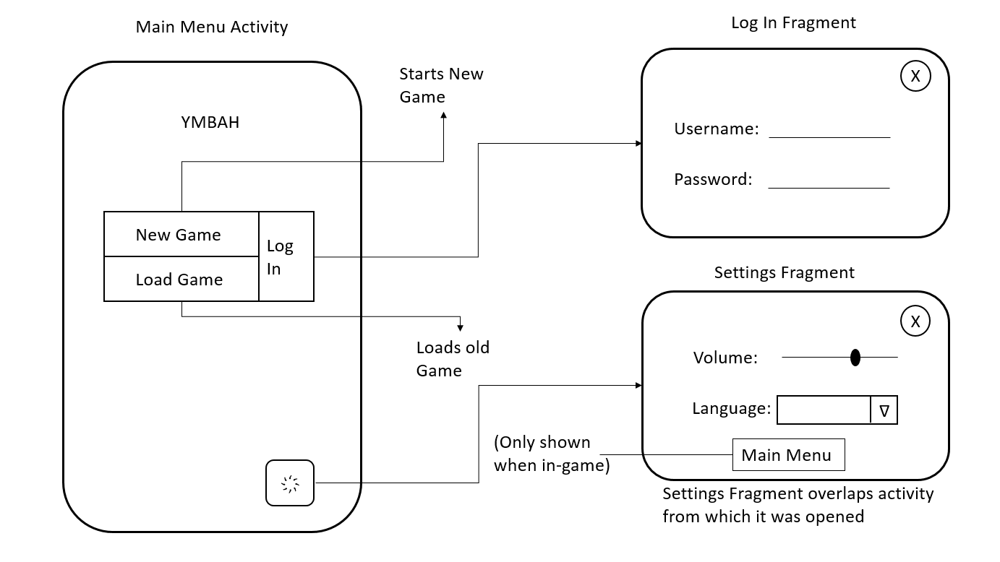
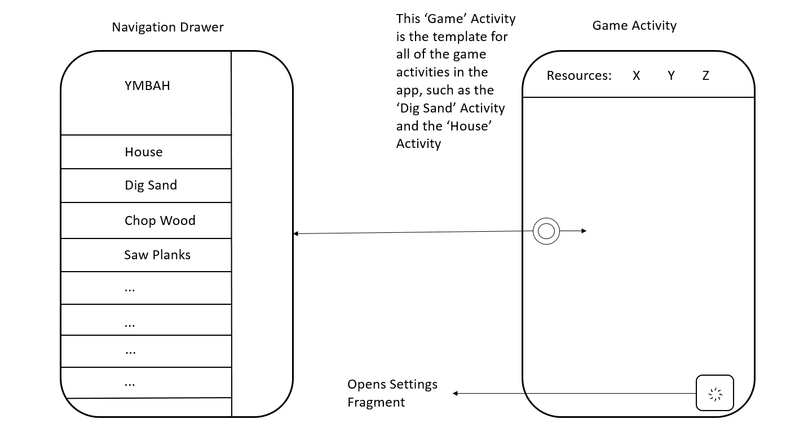

#Design Document for Project YMBAH

##Minimum Viable Product

The minimum viable product needs to include the following features:

* A main menu screen with a 'New Game' button, a 'Continue game' button, a 'Log in' button and a 'settings' button
* A settings screen with a language select option
* A connection to a server that stores user data
* A screen where the user can build their house
* (At least) one mini-game that allows the user to collect resources
* A drawer that provides navigation between the game screens

##Classes and Methods

* Game.class

Public Method | Return Type | Description
------------- | ----------- | -----------
GetAmount(Resource) | Int | Gets the collected amount of resource 'Resource'
SetAmount(Resource, Int) | Void | Sets the collected amount of resource 'Resource'
DoneCollecting() | Boolean | Checks if the user collected enough resources to build the house

* GameRules.class

Public Method | Return Type | Description
------------- | ----------- | -----------
GetLimit(Resource) | Int | Gets the necessary amount of resource 'Resource' needed to complete the game

##Sketches of UI

##API's and frameworks

The user data for this app will be stored online using the 'Parse' API. In the Log-in Fragment, the user enters their username and password and their statistics are retrieved from the database. 