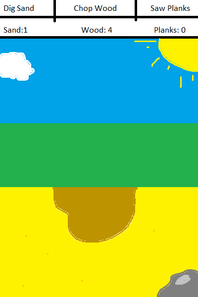

# PROJECT: YMBA
##The Android 'Mini-Game' Game by Jan Geestman 10375406

You Must Build A House (YMBAH) is a game that features a variety of different mini games. The overall objective is to build a house. This is accomplished by several mini-games which simulate different construction steps (Chopping trees, Building a frame, Mining for materials, etc.). These mini-games make use of touch-screen finger tracking where the users have to perform tasks with varying levels of difficulty and precision. 

##Features

* More than X different mini-games that test your skill and precision! (Where X is dependent on remaining production time)
* Progressively more difficult levels that test you speed and managing skills!
* Survival and Zen game modes!
* Stunning Graphics! (maybe...)

##MVP

This app is very modular in design; Parts and features can be added or removed as time allows. However, There are several different features that are required for basic functionality. 

* Home screen
> This should speak for itself. The home screen is where players can choose to start a game or navigate to the options menu. Clicking on 'New Game' will give the option to choose between different game modes.

* Options screen
> The options screen allows users to change different settings of the app. This includes but is not limited to: Language and sound/music volume levels.

* Game screen
> This is the meat of the product. As envisioned, the game screen features a static background with various moving elements. The player will be required to perform an action by use of the touch screen. For example:

> On this screen the player is tasked to dig some sand. The line the user must trace is made visible due to the discolouration in the sand. By tracing this edge, the sand is dug and will fly towards the top of the screen. The user has now collected 1 sand resource and the counter at the top of the screen will increment by 1. The screen then refreshes, either by fading to white/black and back, or by 'moving' the screen over to the next area (Or just spawning a new sand pile). The user is able to switch to other screens by using the navigation bar at the top of the screen. 
This Game screen can be extended for various activities as time allows.

##Platform Information

All of the app can be programmed using basic Android libraries. If needed, I can try to write my own basic game engine that allows the app to run properly, but I don't see this as necessary.

##Potential Problems

###Game Engine

As discussed above, the app might require a more advanced game engine than the basic libraries allow. If this is the case, the scope of this project could increase dramatically. Using an external engine might be possible, but this requires an extra learning period for this new API. If all else fails the game can be adapted to function using simple button presses and menu navigation, however this is extremely basic and probably too small of a project scope.

###Art

The game requires various art assets in order to provide clear communication to the user and, of course, to be visually pleasing. Some of these assets may be borrowed from external sources, but some I will have to create myself. This could become a time sink. The focus of this project should lie with the programming and not the art so very basic shapes and colours as used in the images above will have to suffice if time runs out.

##Review of similar app

This format of collecting resources by clicking the screen and building facilities is mostly found in incremental games. This format is (usually) infinite and very basic. My game is different because it requires more intensive actions from the user in order to proceed. The game can run on a timer (build a house in 5 minutes), requiring the player to manage their time efficiently in all activities. While this game is theoretically infinite, every round the difficulty will increase until it's no longer feasible to build the house within the time limit. If development time allows, every round will get more complex, adding more and more steps to the house building process. The time limit could be substituted by a horde of attacking zombies (just an idea). As stated earlier, this game is very modular and open where features can be added if there is time for them.